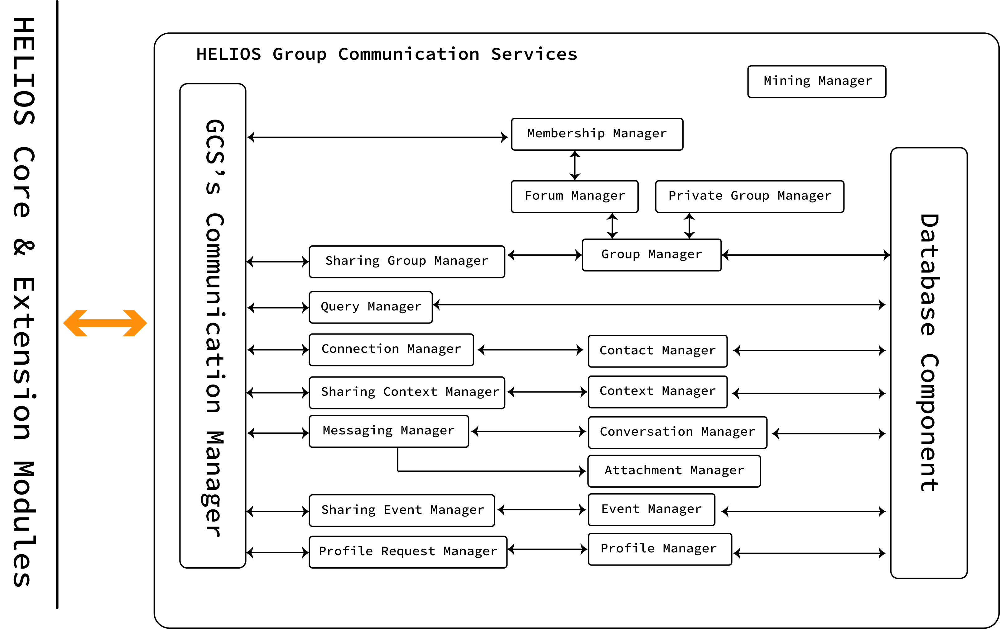

# HELIOS Group Communication Services #
## Introduction

HELIOS Group Communication Services offer a Decentralized Group Communication Management 
framework that aims to provide services that emphasize smooth communications and 
interactions with other peers based on context and time criteria. The HELIOS Group Communication 
Services are built on top of several HELIOS components (core and extension modules) and expose 
several functionalities, such as management of contacts, events, user profile, context and group 
communication.

The Overview of HELIOS Group Communication Services is depicted in Figure below and provide a number
of different managers to facilitate the development of group communication applications. All 
communications and interactions are stored locally in the user's device in a database component. 



## Communication Manager

At the heart of the Group Communication Services, lies the communication protocol that allows us
to send and receive direct messages to/from other users in the network, based on their HELIOS
identifier, as well as subscribe to specific topics in order to interact with a group of peers
at once. The ``ReliableCommumicationManagerImpl`` runs as a Service in the background and
interacts with h.core-Messaging and h.core-Messaging-NodeJSlibP2P modules. In detail, it allows
 us to:

* **register receiver(s)**: The Communication Manager allows us to register handler functions for
 different types of messages based on a protocol Identifier. By registering different receivers
 for different protocols, we are able to handle direct messages, friend requests, context/event
 /forum invitations, etc. The protocol Identifier is used in the protocol negotiation process
 and if the listening peer does not support the requested protocol Id, the stream is ended. 
 
* **send direct message(s)**: Different types of direct messages can be sent to other peers based
 on a protocol identifier already registered to a receiver.
* **subscribe to forum(s)/private group(s)**: We leverage the pub/sub system provide by libp2p
 and exposed by h.core-Messaging-NodeJSlibP2P, to congregate peers arround topics. Each topic is
 defined by a title and a password. For each private group and forum we assign a listener to
 handle message received events. 
* **announce/unannounce tags**: By announcing a tag in the network, users make themselves
 discoverable by other peers that are announcing and observing the same tag. 

The ``ReliableCommumicationManagerImpl`` implements Lifecycle Manager's OpenDatabaseHook where
 the define method ``onDatabaseOpened`` is called when the database is being opened. When the
 database is being opened the ``ReliableCommumicationManagerImpl`` retrieve from the database the
 details of the forums and private groups the user has subscribed in the past in order to
 subscribe on startup and receive new messages, if exist. 

## Context Management
The idea of Context(s) is unique to the HELIOS ecosystem and our main goal is to address the dynamic
nature of human communication in three different dimensions: contextual, spatial and temporal
. The interactions among different users in the network are recorded in the contextual ego network
(h.core-SocialEgoNetwoork) which is unique for each user. One can compare context(s) with
channels in Slack but HELIOS Contexts can be associated with a specific location and/or a
specific time frame. Context(s) can be shared with other HELIOS users and different threads of
conversations can be initiated one-on-one/group. Each context is described by a universally
unique identifier (UUID), a name and a color (defined by the user). Additionally, based on the
type of context, users can define latitude and longitude, for Location Contexts, or start and
end time, for Time Contexts. In the future, we plan to support Spatiotemporal Contexts as well. 

GCS provides a ``ContextManagerImpl``, a ``SharingContextManagerImpl``, a ``ContextFactoryImpl``, a
``ContextInviteFactory`` and a ``ContextInviteReceiver`` to facilitate the efficient management of
contexts. The ``Context Manager`` interacts with the h.core-Context Module and the
``DatabaseComponent`` and allows adding/removing Contexts, getting existing/pending contexts, associating 
conversations with specific contexts, etc. The ``ContextFactory`` facilitates the generation of 
contexts and the ``ContextInviteFactory`` the generation of incoming/outgoing ``ContextInvite``s. 
The ``SharingContextManager`` interacts with the ``CommunicationManager`` and the ``ContextManager``
and is responsible for sending Context Invites as well as accepting or rejecting incoming context 
invitations. Finally, the ``ContextInviteReceiver`` handles incoming context invitation requests. 

```java
/*The LocationContextProxy extends the functionality of LocationContexts as defined in h.core
-Context module */
//ContextFactory allows the creation of a LocationContext
LocationContextProxy locationContextProxy =	contextFactory.createLocationContext(name, color, lat, lng, sradius);

//add the new context to database
contextManager.addContext(locationContext);

//set the created location context as active in the social ego network
egoNetwork.setCurrent(egoNetwork.getOrCreateContext(locationContext.getId()));

//create context invitation
ContextInvitation contextInvitation = contextInvitationFactory.createOutgoingContextInvitation(contact, context);

//send context invitation to contact
sharingContextManager.sendContextInvitation(contextInvitation);  

//accept context invitation
sharingContextManager.acceptContextInvitation(contextInvitation);     

//reject context invitation
haringContextManager.rejectContextInvitation(contextInvitation);

//load pending context invitations
Collection<ContextInvitation> pendingContextInvitations = contextManager.getPendingContextInvitations();
```

## Contact Management

GCS provides a ``ContactManagerImpl`` implements ``ContactManager`` which interacts with the
Database Component and allows adding, removing, getting Contacts or Pending Contacts from the
database. The ``PendingContactFactoryImpl`` facilitates the generation of incoming and outgoing
Pending Contacts. The ``ConnectionManagerImpl`` interacts with the
``ReliableCommunicationManagerImpl`` and is  responsible for sending connection requests to other
peers and accepting or rejecting incoming connection requests. Finally, the
``ConnectionRequestReceiver`` handles incoming connection requests/responses. While sending a
connection request, the peer includes some connection information such as username, text message
, timestamp, context identifier and conversation identifier. In the case of connection requests
, when sending an outgoing connection request, the conversation identifier is always empty and
if the peer accepts the connection request, it sends back to the requesting peer connection
information including a generated conversation id that allows initializing a conversation in the
defined context, in case of establishing an initial connection the context is always the default.

```java
//send connection requests
PendingContact pendingContact = pendingContactFactory.createOutgoingPendingContact (peerId, nickname, message);
pendingContactFactory.createOutgoingPendingContact(pendingContact);

//accept connection request
connectionManager.acceptConnectionRequest(pendingContact);

//reject connection request
connectionManager.rejectConnectionRequest(pendingContact);

//load pending contacts
contactManager.getPendingContacts();

//load all contacts
contactManager.getContacts();

//load contacts of the given context
contactManager.getContacts(contextId);
```

## Profile Management

Every Social Media platform allows its users to define their profiles. GCS provides a
``ProfileManagerImpl``, which is responsible for defining, storing and updating user’s different
profiles for different contexts. A user can request to access the profile of a peer on demand
only if this peer is already connected with the user (they are friends). The
``SharingProfilileManagerImpl`` is responsible for interacting with the ``CommunicationManager
`` and sending a profile request/response to the defined peer. Finally, the
``ProfileRequestReceiver`` is responsible for handling the received profile request and responses. 

```java
//Stores profile in database. Note that, each profile is linked with a specific context.
profileManager.addProfile(p);

//Update Profile
profileManager.updateProfile(p);

//send profile reuqest to contact
sharingProfileManager.sendProfileRequest(contactId,contextId);

/*Send profile response to profile request to contact .Note that, this response is sent
 automatically from the SharingProfileManagerImpl when a ProfileRequestReceivedEvent occurs
. ProfileRequestReceivedEvents are broadcasted by the ProfileRequestReceiver.
*/
sharingProfileManager.sendProfileResponse(contactId,contextId);
```

## Group Management

Group communications refers to communication between affiliate groups of users. Through groups
, users form loosely connected communities around a topic, hobby, social group, etc. A user can
be a member and communicate with several groups in parallel. The HELIOS Group Communication
Services provide two different types of groups: (a) private groups, which can only be shared by
the owner, and (b) forums, which can be split into different subtypes. We detail each group type
below.

### Private Groups

The main goal of group conversations is to bring groups of people into a single place that
encourages focused communication. Private groups are user-created, invite-only non-searchable
groups of conversation. Each private group is described by a group identifier, password, context
identifier, immutable name and owner id. In private groups, all members have read/write
permissions by default but only the owner can invite members to join the group.

The ``PrivateGroupManagerImpl`` interacts with the ``DatabaseComponent`` and allows adding/removing
private groups, adding/removing members to/from groups that the peer is the owner. To join a
private group, another peer needs to know the group identifier and password, information that
becomes available through Group Invites and handled by the ``SharingGroupManagerImpl``. Finally, only
the owner can see the member list of the group and he/she can only remove members from the
conversation. 

```java
/*The GroupFactoryImpl facilitates the creation of different group types. This method creates a
non-sharable Group of conversation with the given name*/
PrivateGroup privateGroup = groupFactory.createPrivateGroup(name, currentContextId);

//stores the given private group to database
privateGroupManager.addPrivateGroup(privateGroup);

/*Alternatively, GroupManagerImpl can be used to acheive the same result. GroupManager is able to
 manage different types of groups (private groups, or forums)*/
groupManager.addGroup(privateGroup);

/*The GroupInvitationFactoryImpl facilitates the creation of incoming and outgoing group
 invitations.*/
//Creates an outgoing Group Invitation given the contact identifier and corresponding group.
GroupInvitation groupInvitation = groupInvitationFactory.createOutgoingGroupInvitation(contactId, privateGroup);
sharingGroupManager.sendGroupInvitation(groupInvitation);

```

### Forums

Forums differ from private groups since they are sharable groups of discussions and are
controlled by administrators and moderators. GCS provide three different types of forums:

* **Public Forums**, which are discoverable by other peers and anyone can join without permission
from the administrator or moderators. However, the access level of new members is defined by the
 administrator in the creation phase of the forum.
* **Protected Forums**, which are discoverable by other users but the peer need to request access
permissions by the moderators. 
* **Secret Forums**, which are not discoverable by other users, and a peer can join a secret
 forum only he/she has been directly invited by another member of the group.
 
HELIOS Forums can be linked to a specific location or time frame and thus can be further
subdivided in the following types:

* **Named Forums** (``Forum``), all forums are named forums and are described ny a name and list of
 manually assigned tags that usually represent relevant to the topic keywords. 
* **Location Forums** (``LocationForum``), allow users to link a named forum with a specific
location by assigning latitude, longitude and active radius. 
* **Seasonal Forums** (``SeasonalForum``), allow users to link a named forum with a specific
season, daytime or timespan.

The GCS provide the ``ForumManagerImpl`` interacts with the ``DatabaseComponent`` and is
responsible for getting/adding/removing different types of forums.

```java
/*The GroupFactoryImpl facilitates the creation of different group types. This method creates a
sharable location forum with the given name. The created forum will be public and the default
member role for new members will be editor (they can read and write messages to the forum)*/
Forum forum = groupFactory.createLocationForum(
                                                name,
                                                contextId,
                                                GroupType.PublicForum,
                                                tags,
                                                ForumMemberRole.EDITOR, 
                                                latitude, 
                                                longitude, 
                                                radius
                                        );

//stores the given forum to database
forumManager.addForum(forum);

//load all forums the user has subscribed to
forumManager.getForums();

//load all forums the user has subscribed to in the given context
forumManager.getForums(contextId);

/*load all members of the given forum (if user is not administrator/moderator in the given forum
 the returned list will be empty*/
forumManager.getForumMembers(groupId)

//returns user's role in the given forum
forumManager.getRole(groupId)

//user reveals his/her true identity to group (username & peer id will be enclosed in group messages)
groupManager.revealSelf(groupId, true);

/*Returns the pseudo-identifier and pseudonym the user uses in the given group. The fake identity
 is created when the use joins for the first time a new forum/private group*/
groupManager.getFakeIdentity(groupId);

//Alternatively, GroupManagerImpl can be used to achieve the same result.
groupManager.addGroup(forum);

/*The GroupInvitationFactoryImpl facilitates the creation of incoming and outgoing group
invitations. The following method creates an outgoing Group Invitation given the contact identifier
 and corresponding group.*/
GroupInvitation groupInvitation = groupInvitationFactory.createOutgoingGroupInvitation(contactId, forum);
sharingGroupManager.sendGroupInvitation(groupInvitation);

```

### Forum Membership Management
GCS provide a Forum Membership management mechanism to allow administrators and moderators to
revoke access rights from a user or a group of users if they behave inappropriately. Even though
forums can be shared by their members, common forum members do not have access to the global
membership list of the forum, only administrators and moderators can access this knowledge. In
detail, HELIOS forums organize forum members into four user groups: 

* **Administrators** can promode/demote members from administrators to readers
* **Moderators** can also promote/demote members from editors to readers. However, they cannot
 promote/demote moderators/administrators.
* **Editors** can only read/write to the forum but they do not have access to the member list
* **Readers** can only read posts from the forum but they cannot post messages or access the
 member list

The creator of the forum is automatically assigned as administrator. While creating a forum, the
administrator can define the user group that new members are assigned to. As we have already
mentioned, the global membership list of a forum is retained only by administrators and
moderators, other user groups only retain the list of moderators. When a new peer joins a forum
, he/she needs to notify all moderators to include her in the member list. This is handled
automatically by the ``SharingGroupManagerImpl``. The ``ForumMembershipManagerImpl`` is
responsible for managing memberships in forums.

```java
/*Checks if the user is administrator/moderator of the forum and if yes it updates the role of a
Forum Member in the Forum Membership List and notifies peer and moderators*/
forumMembershipManager.updateForumMemberRole(forum, forumMember, updatedRole)
```

## Messaging

Messaging is the cornerstone of group communications. GCS offer a number of managers to
facilitate one-on-one and group communication in different contexts. More specifically, the
``ConversationManagerImpl`` cooperates with the ``DatabaseComponent`` and is in control of adding 
one-on-one or group messages, adding/removing messages to/from favorites and raising read flags
for messages. By adding messages to favorites, one can have quick access to such messages. Each
Message is described by a message header and the main message. The main message can be a private
or a group message. Private messages are described by an identifier, group identifier (or
conversation identifier), body and type. Peers can send text, video call and attachment messages
to private conversations. Group messages are described similarly with private messages but they
also contain peer information since not all group members are included in the user's connections.
Additionally, peers could choose to remain anonymous in group conversations and only a pseudonym
is visible to the group. Message Headers contains some general information about the message such
as if the message is incoming and the message state. The message state can be pending (only
valid for outgoing messages), delivered or seen. 

Additionally, GCS provide a ``MessagingManager``, which is responsible for sending private and group 
messages to other peers or groups. The ``MessageTracker`` is in charge of updating the total message 
counter and the unread message counter to provide updates to the users. Finally, the 
``PrivateMessageReceiver`` and ``GroupMessageListener`` handle incoming private and group messages. 

```java
/* PrivateMessageFactory facilitates the creation of different types of private messages (text
, attachment, videocall). Below, the PrivateMessageFactory creates a new private Message given the 
group Identifier, timestamp and text.
*/
Message privateMessage = privateMessageFactory.createTextMessage(groupId, timestamp, text);

//Sends the given private message in the given contact and context and returns the MessageHeader
MessageHeader header = messagingManager.sendPrivateMessage(contactId, contextId, privateMessage);

/* GroupMessageFactory facilitates the creation of different types of group messages. Below, the
 GroupMessageFactory creates a new groupMessage given the group identifier, text, timestamp, user
's pseudonym for the group and user's pseudo-identifier for the group.
*/
GroupMessage groupMessage = groupMessageFactory.createGroupMessage(groupId, text, timestamp, fakeIdentity.getFirst(), fakeIdentity.getSecond());

//Sends the given group message in the given group and returns the GroupMessageHeader
GroupMessageHeader header = (GroupMessageHeader) messagingManager.sendGroupMessage(group, groupMessage);

//MessageTrackerImpl marks the given message as read and updates the group count.
messageTracker.setReadFlag(groupId, messageId);
```


## Project Structure
This project contains the following components:

groupcommunications/src - The source code files.
